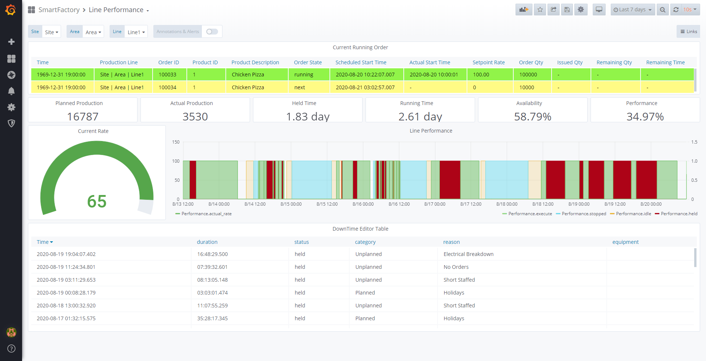
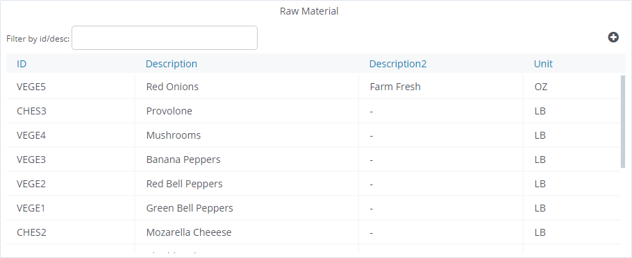
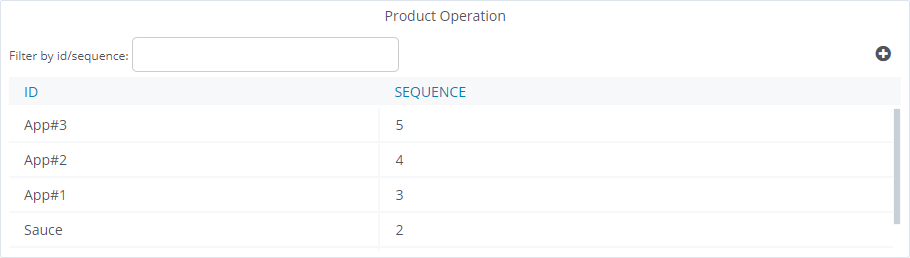
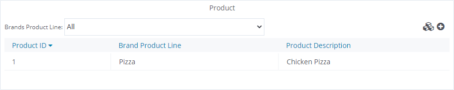
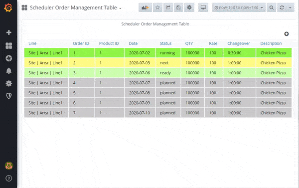
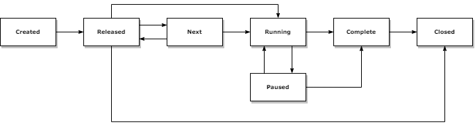

# 

> Open source Manufacturing Execution and Performance Monitoring built on [Grafana](https://grafana.com), [Influx](https://www.influxdata.com/), and [Postgres](https://www.postgresql.org/).

Define your master data, push your machine metrics, start collecting and analyzing your manufacturing data with Libre. Libre is an open source manufacturing execution and performance monitoring tool.

- _Define:_ Your manufacturing master data including your enterprise model, downtime reasons, products, ingredients and product steps.
- _Capture:_ Connect up your machines using a variety of methods into key buckets with an InfluxDB Historian
- _Use:_ Schedulers create and schedule orders, operators execute orders and capture downtime reasons.
- _Improve:_ Get key insights into your manufacturing, understand your biggest losses, visualize OEE.
- _Extensible:_ Built on Grafana, Influx and postgres push your key process parameters to view alongside your production dashboards. Extend with your Grafana dashboards. Free to innovate.



## Try it out

Use the [Libre Simulator](https://github.com/Spruik/Libre-Simulator) to test out Libre. The quickest way to run Libre and the Libre Simulator it is with the docker-compose command `docker-compose -f docker-compose.yml -f docker-compose.sim.yml up -d`. This will start up Libre and the simulator together. After running the command, browse to `http://localhost:3000` to access Grafana and `http://localhost:1880/ui` to control the simulation.

See [Try it out](/docs/try-it-out.md) for more information.

## Getting Started

### Installation

Libre requires the following on an x86 architecture server

- docker (>= 18 required)
- docker-compose (>= 1.25 required)
- git (>= 2 optional)

The `docker-compose.yml` file is required to start. Easiest way to get this is to clone this repository.

```shell
$ git clone https://github.com/Spruik/Libre

Cloning into 'Libre'...
remote: Enumerating objects: 165, done.
remote: Counting objects: 100% (165/165), done.
remote: Compressing objects: 100% (115/115), done.

Receiving objects: 100% (165/165), 176.45 KiB | 3.60 MiB/s, done.
Resolving deltas: 100% (49/49), done.

$ docker-compose up -d
Creating network "libre_default" with the default driver
Creating volume "libre_grafana_plugins" with default driver
Creating volume "libre_grafana_provisioning" with default driver
Creating volume "libre_postgres_data" with default driver
Creating volume "libre_influx_data" with default driver
Creating libre_influx_1   ... done
Creating libre_postgres_1 ... done
Creating libre_grafana_1  ... done
Creating libre_postREST_1 ... done

```

#### Set Grafana Admin Password

Once Libre is installed and running, navigate to `http://<server>:3000/` and use the default Grafana login username `admin` and password `admin` to login. You will then be prompted to change the default password.

### Define your factory Model

Define your factory model using the provided `SmartFactory/Master Data` dashboard. Start by long-clicking the Enterprise in the equipment panel and add a Site. Long-click the newly created site and add an Area. Continue this process to add in a Line and equipment on the line. Add in any additional Sites, area, lines and equipment to mimic your enterprise.


Next, define your reason codes. Long click ReasonCodes in the Reason Codes panel and add a category. Once a category has been created, long click the category to add in a reason.

> Two recommend categories are `Planned` and `Unplanned`


Raw Materials are added during product operations. Products are made up of a number of product operations. Finally, products can be categorized by groups. Start by entering in Raw Material information by clicking the (+) on the Raw Material panel. These are the ingredients that go into your final product. Once raw materials have been added, add in the required Product Operations in the Product Operation panel. Product Operations are the steps to manufacture the final product and is where a raw ingredient is added. For example `Fill Tank` or `Add Label`.





Once Raw Materials and Product Operations are added create a Product group using the Products Panel. Click the (+) and select Product Group, enter a name and save. Follow the same process and select Product. You can now add any number of product operations, and optionally an ingredient, to the product definition. At a minimum provide a product name, product group and save. Repeat for all your products.



Now that you have defined your factory model, downtime reasons, ingredients, product operations and products your are ready to start scheduling orders.

### Scheduling Orders

Schedule orders on your lines using the `SmartFactory/Scheduling` dashboard. To setup use the `Production Line Start Time Setter` to define the start time for each line. This is the time whereby an order will be first scheduled for the day. For 24hr operation, set to 12:00AM.

Use the `Scheduler Order Management Table` panel to create orders. Click the (+) define the order details and submit. Orders can be edited until they are released. Once an order has been released it can no longer be edited. Orders are edited by clicking in them in the panel.



Orders have the following state model:



The `SmartFactory/Line Schedule` dashboard shows the schedule for the selected manufacturing line. Orders can be set to next/running so that they are visible on the `SmartFactory/Line Performance` dashboard.

### Executing Orders

Orders be executed by clicking from the list in either `SmartFactory/Line Performance` or `SmartFactory/Line Schedule` and selecting Running. Only a single order can be Running at once per line. The Paused state can be used to pause orders until they are ready to be execute on again or completed. Once an order is running machine state and counts are logged against that order.

### Integrating Machines

Machines will need to push data to the following buckets and schemas.

#### Availability

The machine will need to publish to the `Availability` Influx bucket with the following information. It is important that the tags match the [model definition](#Define-your-factory-Model). Log data on state change. `category`, `reason`, `parentReason` and `comment` are for classification of downtime category/reason. The Machine can self report (if known), otherwise leave blank. An operator can always split a reason and override

| Name         | Type  | Variable Type | Details                                                                                       |
|--------------|-------|---------------|-----------------------------------------------------------------------------------------------|
| Site         | tag   | string        |                                                                                               |
| Area         | tag   | string        |                                                                                               |
| Line         | tag   | string        |                                                                                               |
| idle         | field | number        | ∈ [1, 0] for active / not active                                                              |
| stopped      | field | number        | ∈ [1, 0] for active / not active                                                              |
| held         | field | number        | ∈ [1, 0] for active / not active                                                              |
| execute      | field | number        | ∈ [1, 0] for active / not active                                                              |
| complete     | field | number        | ∈ [1, 0] for active / not active                                                              |
| status       | field | string        | String - ∈ ['idle', 'stopped', 'held', 'execute', 'complete']. String representation of state |
| category     | field | string        | Label of the category                                                                         |
| reason       | field | string        | Label of the reason                                                                           |
| parentReason | field | string        | Child reason of the category (same reason as above)                                           |
| comment      | field | string        | Comment on the reason                                                                         |

#### Performance

The machine will need to publish to the `Performance` Influx bucket with the following information. It is important that the tags match the [model definition](#Define-your-factory-Model). Log data on state, planned rate or a significant actual_rate change. Ensure to use identical units for `planned_rate` and `actual_rate`.

| Name         | Type  | Variable Type | Details                                                                                       |
|--------------|-------|---------------|-----------------------------------------------------------------------------------------------|
| Site         | tag   | string        |                                                                                               |
| Area         | tag   | string        |                                                                                               |
| Line         | tag   | string        |                                                                                               |
| idle         | field | number        | ∈ [1, 0] for active / not active                                                              |
| stopped      | field | number        | ∈ [1, 0] for active / not active                                                              |
| held         | field | number        | ∈ [1, 0] for active / not active                                                              |
| execute      | field | number        | ∈ [1, 0] for active / not active                                                              |
| complete     | field | number        | ∈ [1, 0] for active / not active                                                              |
| status       | field | string        | String - ∈ ['idle', 'stopped', 'held', 'execute', 'complete']. String representation of state |
| planned_rate | field | float         | The planned rate or line theoretically best possible rate                                     |
| actual_rate  | field | float         | The actual machine rate                                                                       |

#### Quality

The machine will need to publish to the `Quality` Influx bucket with the following information. It is important that the tags match the [model definition](#Define-your-factory-Model). Log data on state, planned rate or a significant actual_rate change.

| Name         | Type  | Variable Type | Details                             |
|--------------|-------|---------------|-------------------------------------|
| Site         | tag   | string        |                                     |
| Area         | tag   | string        |                                     |
| Line         | tag   | string        |                                     |
| Temp         | field | number        | Quantity of good product this order |

#### Order Performance

The machine will need to publish to the `OrderPerformance` Influx bucket with the following information. Log data on issued_qty change.

| Name         | Type  | Variable Type | Details                           |
|--------------|-------|---------------|-----------------------------------|
| order_id     | tag   | string        | Current order id                  |
| issued_qty   | field | number        | Count of good products this order |

### Analyzing the Manufacturing Data

Analyse your manufacturing data using the `SmartFactory/Line Performance` and `SmartFactory/Analysis` dashboards. Line Performance offers analysis of performance and availability whilst the Analysis dashboard drills into time loss through Downtime Pareto graphs and sunbursts of both Downtime duration and frequency.

## Developing

Prerequisites

- docker (>= 18 required)
- git (>= 1.20 required)

1. Run the docker compose with the docker-compose.dev.yl file. Include the --build argument to build containers from source. `docker-compose -f docker-compose.dev.yml up --build`
2. To clear data whilst developing ensure to remove volumes `docker-compose -f docker-compose.dev.yml rm -v`

## Building

Prerequisites

- docker (>= 18 required)
- git (>= 1.20 required)

1. Clone this repository with `git clone https://github.com/Spruik/Libre` and enter directory `cd Libre`
2. Change directory into grafana and build the container `cd grafana`, `docker build . -t spruiktec/libre-grafana`
3. Change directory up one level, into postgres and build the container `cd .. && cd postgres`, `docker build . -t spruiktec/libre-postgres`

## Contributing

For any issue, there are fundamentally three ways an individual can contribute:

- By opening the issue for discussion: For instance, if you believe that you have uncovered a bug in, creating a new issue in the [GitHub issue tracker](https://github.com/Spruik/Libre/issues) is the way to report it.
- By helping to triage the issue: This can be done either by providing supporting details (a test case that demonstrates a bug) or providing suggestions on how to address the issue.
- By helping to resolve the issue: Typically, this is done either in the form of demonstrating that the issue reported is not a problem after all, or more often, by opening a Pull Request that changes some bit of something in the panel in a concrete and reviewable manner.

## License

Libre is distributed under the [Apache 2.0 License](https://github.com/spruik/libre/blob/master/LICENSE).

## Change Log

- 1.0.1
  - Fix Line Performance Downtime table event duration
  - Fix Line Performance Graph Query Bug
  - Fix Spelling
  - Bump Revision

- 1.0.0 Initial Public Release
