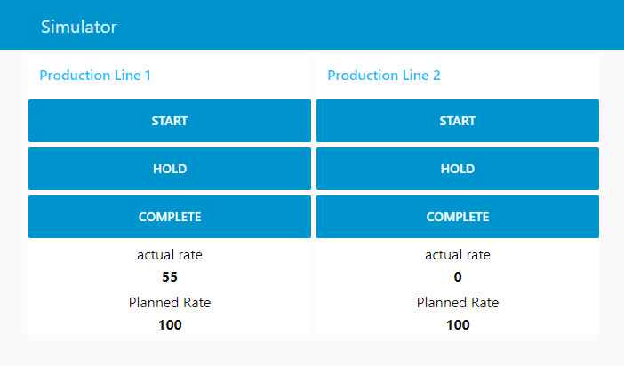

# Try it Out

Try out Libre before spending time on setup. Alternatively checkout the [Spruik Technologies](https://www.youtube.com/channel/UCLSo9vtYPXkuOJkXNnooCjQ) youtube channel for videos.

## Prerequisits

- docker (>= 18 required)
- docker-compose (>= 1.25  required)
- git (>= 1.25  optional)

## Running

1. Clone this repository `git clone https://github.com/Spruik/Libre`

```shell
$ git clone https://github.com/Spruik/Libre
Cloning into 'Libre'...
remote: Enumerating objects: 165, done.
remote: Counting objects: 100% (165/165), done.
remote: Compressing objects: 100% (115/115), done.

Receiving objects: 100% (165/165), 176.45 KiB | 3.60 MiB/s, done.
Resolving deltas: 100% (49/49), done.

```

```shell
cd Libre
```

2. Start Libre with Libre Simulator `docker-compose -f docker-compose.yml -f docker-compose.sim.yml up -d`

```shell
$ docker-compose -f docker-compose.yml -f docker-compose.sim.yml up -d
Creating network "libre_default" with the default driver
Creating volume "libre_grafana_plugins" with default driver
Creating volume "libre_grafana_provisioning" with default driver
Creating volume "libre_postgres_data" with default driver
Creating volume "libre_influx_data" with default driver
Creating libre_influx_1   ... done
Creating libre_postgres_1    ... done
Creating libre_simulator_1   ... done
Creating libre_postREST_1    ... done
Creating libre_grafana_1     ... done

```

3. Navigate to `https://localhost:3000` log into grafana with username admin and password admin. Explore the SmartFactory dashboard folder.

4. Navigate to `https://localhost:1880/ui` to start/stop and complete a line.


